```mermaid
erDiagram
    USERS {
        uuid id PK
        varchar email UK
        varchar password_hash
        varchar name
        enum role "PROSUMER | CONSUMER | GRID_OPERATOR | ADMIN"
        uuid grid_zone_id FK
        boolean is_active
        timestamp created_at
        timestamp updated_at
    }

    WALLETS {
        uuid id PK
        uuid user_id FK, UK
        decimal balance
        decimal escrow_balance
        timestamp created_at
        timestamp updated_at
    }

    ENERGY_SOURCES {
        uuid id PK
        uuid prosumer_id FK
        enum type "SOLAR | WIND | BATTERY | HYDRO"
        decimal capacity_kw
        date installed_date
        boolean is_active
        timestamp created_at
    }

    SMART_METERS {
        uuid id PK
        varchar serial_number UK
        uuid user_id FK
        uuid grid_zone_id FK
        enum status "ACTIVE | INACTIVE | MAINTENANCE"
        timestamp registered_at
    }

    ENERGY_READINGS {
        uuid id PK
        uuid meter_id FK
        decimal production_kwh
        decimal consumption_kwh
        decimal net_energy_kwh
        timestamp recorded_at
    }

    GRID_ZONES {
        uuid id PK
        varchar name UK
        jsonb boundary_geojson
        decimal max_capacity_kw
        decimal current_load_kw
        enum status "ACTIVE | HALTED | MAINTENANCE"
        timestamp created_at
        timestamp updated_at
    }

    ORDERS {
        uuid id PK
        uuid user_id FK
        enum type "BUY | SELL"
        decimal quantity_kwh
        decimal price_per_kwh
        enum status "ACTIVE | MATCHED | PARTIALLY_FILLED | CANCELLED | EXPIRED"
        uuid grid_zone_id FK
        enum source_type "SOLAR | WIND | BATTERY | HYDRO | ANY"
        timestamp time_window_start
        timestamp time_window_end
        timestamp created_at
        timestamp updated_at
    }

    TRADES {
        uuid id PK
        uuid buy_order_id FK
        uuid sell_order_id FK
        uuid buyer_id FK
        uuid seller_id FK
        decimal quantity_kwh
        decimal price_per_kwh
        decimal total_amount
        enum status "PENDING | DELIVERED | SETTLED | DISPUTED | CANCELLED"
        uuid grid_zone_id FK
        timestamp executed_at
        timestamp updated_at
    }

    SETTLEMENTS {
        uuid id PK
        uuid trade_id FK, UK
        decimal seller_amount
        decimal platform_fee
        decimal carbon_credits_issued
        enum status "PENDING | COMPLETED | FAILED"
        timestamp settled_at
    }

    ESCROWS {
        uuid id PK
        uuid trade_id FK
        uuid buyer_id FK
        decimal amount
        enum status "HELD | RELEASED | REFUNDED"
        timestamp created_at
        timestamp resolved_at
    }

    CARBON_CREDITS {
        uuid id PK
        uuid prosumer_id FK
        uuid trade_id FK
        decimal kwh_generated
        varchar certificate_hash UK
        timestamp issued_at
    }

    COMMUNITY_GROUPS {
        uuid id PK
        varchar name
        uuid grid_zone_id FK
        uuid created_by FK
        text description
        timestamp created_at
    }

    COMMUNITY_MEMBERS {
        uuid id PK
        uuid group_id FK
        uuid user_id FK
        enum role "MEMBER | ADMIN"
        timestamp joined_at
    }

    PRICE_HISTORY {
        uuid id PK
        uuid grid_zone_id FK
        decimal price_per_kwh
        decimal supply_kwh
        decimal demand_kwh
        timestamp recorded_at
    }

    PRICE_ALERTS {
        uuid id PK
        uuid user_id FK
        uuid grid_zone_id FK
        decimal target_price
        enum direction "ABOVE | BELOW"
        boolean is_active
        timestamp created_at
    }

    NOTIFICATIONS {
        uuid id PK
        uuid user_id FK
        enum type "TRADE_MATCHED | TRADE_SETTLED | PRICE_ALERT | GRID_ALERT | SYSTEM"
        varchar title
        text message
        boolean is_read
        timestamp created_at
    }

    AUDIT_LOGS {
        uuid id PK
        uuid user_id FK
        varchar action
        varchar entity_type
        uuid entity_id
        jsonb details
        varchar ip_address
        timestamp created_at
    }

    COMPLIANCE_RULES {
        uuid id PK
        uuid grid_zone_id FK
        varchar rule_name
        text description
        jsonb parameters
        boolean is_active
        uuid created_by FK
        timestamp created_at
        timestamp updated_at
    }

    PLATFORM_CONFIG {
        uuid id PK
        varchar config_key UK
        jsonb config_value
        varchar description
        uuid updated_by FK
        timestamp updated_at
    }

    %% ===== RELATIONSHIPS =====

    USERS ||--o| WALLETS : "has one"
    USERS ||--o{ ENERGY_SOURCES : "owns"
    USERS ||--o{ SMART_METERS : "registers"
    USERS ||--o{ ORDERS : "places"
    USERS ||--o{ NOTIFICATIONS : "receives"
    USERS ||--o{ PRICE_ALERTS : "configures"
    USERS ||--o{ AUDIT_LOGS : "generates"
    USERS ||--o{ CARBON_CREDITS : "earns"

    USERS }o--|| GRID_ZONES : "belongs to"
    SMART_METERS }o--|| GRID_ZONES : "located in"
    ORDERS }o--|| GRID_ZONES : "placed in"
    TRADES }o--|| GRID_ZONES : "executed in"
    COMMUNITY_GROUPS }o--|| GRID_ZONES : "hosts"
    PRICE_HISTORY }o--|| GRID_ZONES : "records for"
    PRICE_ALERTS }o--|| GRID_ZONES : "monitors"
    COMPLIANCE_RULES }o--|| GRID_ZONES : "applies to"

    SMART_METERS ||--o{ ENERGY_READINGS : "produces"

    ORDERS ||--o| TRADES : "buy side"
    ORDERS ||--o| TRADES : "sell side"
    TRADES ||--o| SETTLEMENTS : "settled by"
    TRADES ||--o| ESCROWS : "secured by"
    TRADES ||--o| CARBON_CREDITS : "generates"

    USERS ||--o{ TRADES : "buys"
    USERS ||--o{ TRADES : "sells"

    COMMUNITY_GROUPS ||--o{ COMMUNITY_MEMBERS : "has"
    USERS ||--o{ COMMUNITY_MEMBERS : "joins"
    USERS ||--o| COMMUNITY_GROUPS : "creates"
```

# ER Diagram — GreenGrid

## Overview

This Entity-Relationship diagram shows the database schema for the GreenGrid platform. All tables, columns, types, and relationships are defined below.

---

---

## Table Summary

| Table | Description | Key Relationships |
|-------|-------------|-------------------|
| `USERS` | All platform users (prosumers, consumers, operators, admins) | → Wallet, Orders, Grid Zone |
| `WALLETS` | User balance and escrow tracking | ← User (1:1) |
| `ENERGY_SOURCES` | Solar panels, wind turbines, batteries owned by prosumers | ← User (prosumer) |
| `SMART_METERS` | IoT meters registered to users for energy data | ← User, Grid Zone |
| `ENERGY_READINGS` | Time-series energy production/consumption data | ← Smart Meter |
| `GRID_ZONES` | Geographic trading zones with capacity limits | → Users, Orders, Meters |
| `ORDERS` | Buy/sell orders in the marketplace | ← User, Grid Zone → Trade |
| `TRADES` | Matched trades between a buy and sell order | ← Orders (2), → Settlement |
| `SETTLEMENTS` | Financial settlement records for completed trades | ← Trade (1:1) |
| `ESCROWS` | Funds held during pending trades | ← Trade, User (buyer) |
| `CARBON_CREDITS` | Green energy certificates issued to prosumers | ← User, Trade |
| `COMMUNITY_GROUPS` | Energy co-operatives formed by users | ← Grid Zone, → Members |
| `COMMUNITY_MEMBERS` | Junction table for group membership | ← Group, User |
| `PRICE_HISTORY` | Historical price data per zone | ← Grid Zone |
| `PRICE_ALERTS` | User-configured price notifications | ← User, Grid Zone |
| `NOTIFICATIONS` | In-app notifications for all events | ← User |
| `AUDIT_LOGS` | Tamper-proof action log for compliance | ← User |
| `COMPLIANCE_RULES` | Regulatory rules per zone set by grid operators | ← Grid Zone, User |
| `PLATFORM_CONFIG` | System-wide configuration key-value pairs | ← User (admin) |

---

## Key Indexes

| Table | Index | Purpose |
|-------|-------|---------|
| `ORDERS` | `(grid_zone_id, status, type)` | Fast order book queries |
| `ORDERS` | `(user_id, status)` | User's active orders |
| `TRADES` | `(buyer_id, status)` | Buyer trade history |
| `TRADES` | `(seller_id, status)` | Seller trade history |
| `ENERGY_READINGS` | `(meter_id, recorded_at)` | Time-series queries |
| `PRICE_HISTORY` | `(grid_zone_id, recorded_at)` | Historical price trends |
| `NOTIFICATIONS` | `(user_id, is_read)` | Unread notification count |
| `AUDIT_LOGS` | `(entity_type, entity_id)` | Entity audit trail lookup |
