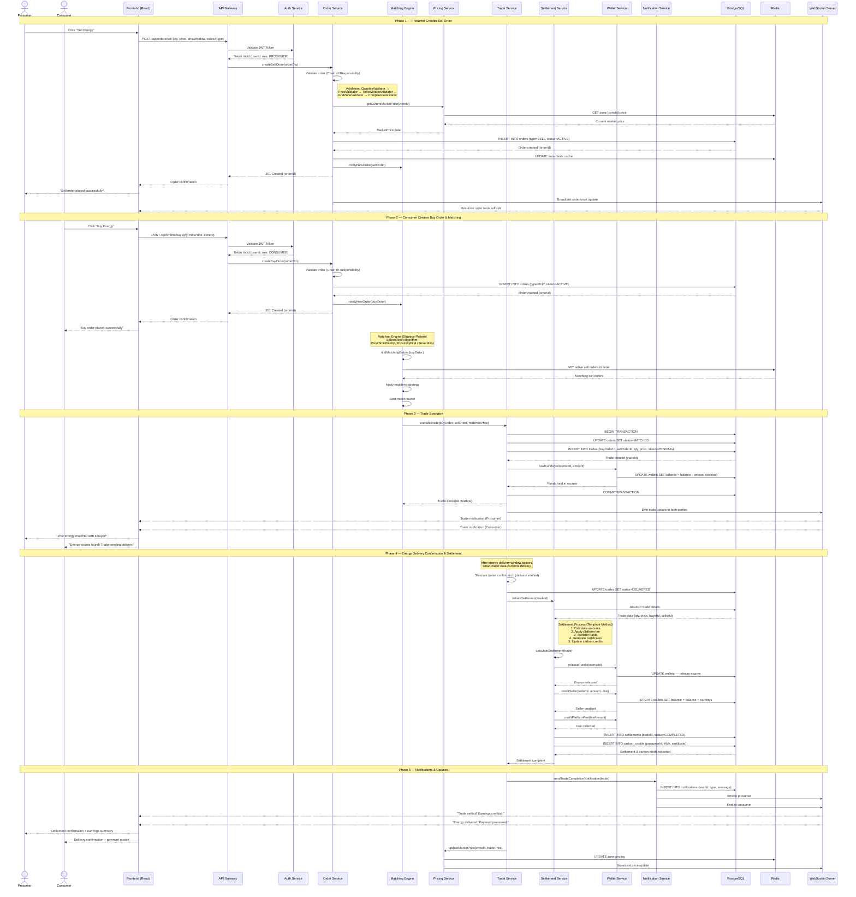

# Sequence Diagram — GreenGrid

## Main Flow: End-to-End Energy Trade (Prosumer Sells → Consumer Buys → Settlement)

This sequence diagram illustrates the complete lifecycle of an energy trade — from a prosumer listing surplus energy, a consumer placing a buy order, the matching engine pairing them, through to settlement and notification.

---

---

## Flow Summary

| Phase | Description | Key Patterns Used |
|-------|-------------|-------------------|
| **1. Sell Order** | Prosumer lists surplus energy. Validated through a chain of validators, stored in DB, order book updated. | Chain of Responsibility, Observer |
| **2. Buy Order & Match** | Consumer places buy order. Matching engine selects the best pairing algorithm and finds a match. | Strategy Pattern |
| **3. Trade Execution** | Trade record created, consumer funds held in escrow. Both parties notified in real-time via WebSocket. | Command, Observer |
| **4. Settlement** | After delivery confirmation, settlement process runs: calculates amounts, transfers funds, generates green certificates. | Template Method |
| **5. Notifications** | Both parties receive real-time notifications. Market price updated for the zone. | Observer, Mediator |
